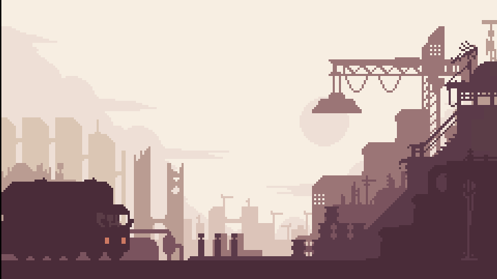

# Parallax City Demo
A tiny TIC-80 Demo of a multi-layer parallax background 

To load the file into your TIC-80 you'll need the "PRO" version (allows text files) found [here](https://nesbox.itch.io/tic80)

To get the graphics from the `.aseprite` file into TIC-80's format I wrote a [commandline tool](https://github.com/mvu-one/SpriteEater)

Artwork is a re-draw of a piece by [PlusPixels](https://mastodon.social/@PlusPixels)
